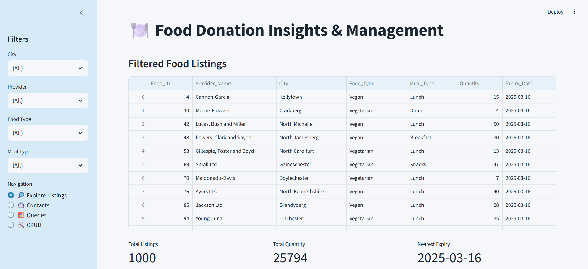
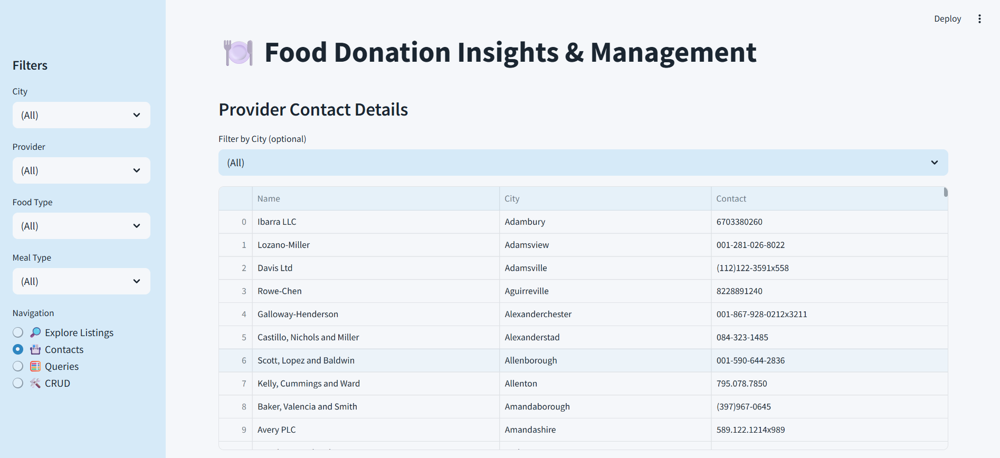
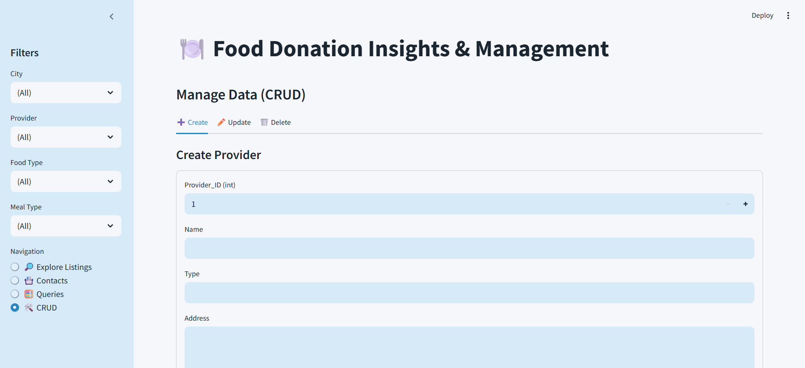

# 🍽️ Food Waste Management System  

## 📌 Project Overview  
This project aims to minimize food wastage and improve food distribution by connecting food providers and receivers.  
It uses **SQL for database management**, **Python (Pandas, SQLite)** for data analysis, and **Streamlit** for a user-friendly web interface.  

---

## 🚀 Features  
- 📊 **15 SQL Queries with Insights** – analyze providers, receivers, food listings, and claims.  
- 🔎 **Filtering Options** – search by city, provider, food type, and meal type.  
- 📇 **Contacts Section** – directly access provider & receiver details.  
- 🛠️ **CRUD Operations** – add, update, or delete records.  
- 📉 **Visual Insights** – track contributions, claims, and high-demand cities.  

---

## 📂 Project Structure  
```

├── app.py                # Streamlit app
├── step1\_data\_analysis.ipynb  # SQL queries + results
├── database.sql          # SQL schema & data
├── requirements.txt      # Python dependencies
├── README.md             # Project documentation
└── screenshots/          # App screenshots

````

---

## 🖥️ Running the App  

1. Clone the repo:  
```bash
git clone https://github.com/your-username/food-waste-management.git
cd food-waste-management
````

2. Install dependencies:

```bash
pip install -r requirements.txt
```

3. Run Streamlit app:

```bash
streamlit run app.py
```

---

## 📷 Screenshots

<p align="center">
  
  
</p>
<p align="center">
  
  
</p>


---

## ✅ Conclusion

The Food Waste Management System provides a scalable solution for reducing wastage and improving distribution.
It bridges the gap between food donors and receivers through **real-time insights, efficient tracking, and interactive tools**.

---

## 👨‍💻 Author

**Your Name** – [LinkedIn](https://www.linkedin.com/in/vignesha-s/) | [GitHub](https://github.com/Vignesha-S)

````
